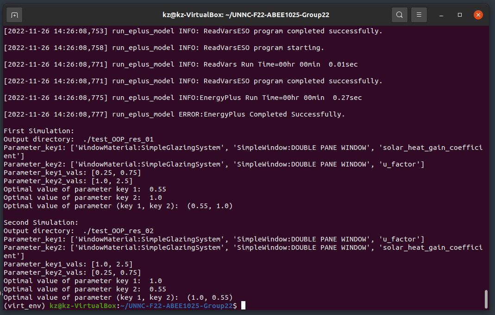

# UNNC-F22-ABEE1025-Group22

### Group member:
Kaifeng ZHU   20411919  
Haonan ZHANG  20411814 
### Architectural Environment Engineering
University of Nottingham Ningbo China

### Cousework Part3
The file is in current repository.

coursework_part3_OOP.py defines a class called simulation which is designed for 
get the best set of parameter values with which the simulation has the highest 
average indoor air temperature.

test_oop.py is the test file, and here is the result:

### Coursework Part4
The Files are in the coursework_part4_data_processing_and_visualization repository.

Before running the code, make sure you are in the this repository.

### The name of this software is Indoor Temperature Plotting.

### The Product requirement document (PRD) can be accseed as following ([PRD](coursework_part4_data_processing_and_visualization/Product%20requirement%20document%20(PRD).md ':include')).

### The User's Guide can be accessed as ([User's Guide](coursework_part4_data_processing_and_visualization/User's%20Guide.md  ':include')).